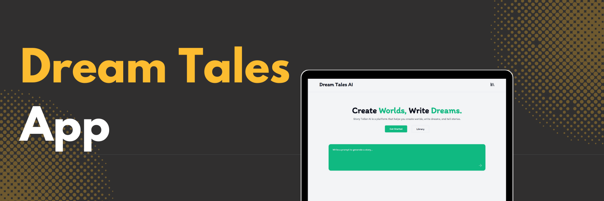

<div align="center">
  <br />
    <a href="https://youtube.com/playlist?list=PLJT1e2CqMCFB5rmMuz36qJUe44KQMLuve&si=ZJI26qnQ25sul2a5" target="_blank">
      
    </a>
  <br />

  <div>
    
    
    
    
    

  </div>

  <h3 align="center">Dream Tales - AI Story Generating App</h3>

   <div align="center">
     Build this project step by step with a detailed tutorial on <a href="https://www.youtube.com/@codespirit369/videos" target="_blank"><b>Code Spirit</b></a> YouTube.
    </div>
</div>

## 📋 <a name="table">Table of Contents</a>

1. 🤖 [Introduction](#introduction)
2. ⚙️ [Tech Stack](#tech-stack)
3. 🔋 [Features](#features)
4. 🤸 [Quick Start](#quick-start)
5. 🕸️ [Snippets (Code to Copy)](#snippets)

## 🚨 Tutorial

This repository contains the code corresponding to an in-depth tutorial available on our YouTube channel, <a href="https://www.youtube.com/@codespirit369/videos" target="_blank"><b>Code Spirit</b></a>.

<a href="https://youtu.be/hs6BtY9ndXA" target="_blank"></a>

## <a name="tech-stack">⚙️ Tech Stack</a>

- React.js
- Next.js
- Typescript
- ShadCN
- Gemini AI
- Stable Diffusion (via Replicate)
- MongoDB
- Vercel AI SDK

## <a name="introduction">🤖 Introduction</a>

This web application allows users to generate unique children's stories using the power of Gemini AI. It also generates corresponding story cover images using the Stable Diffusion model via the Replicate platform. All generated stories and images are stored in MongoDB, making it easy to retrieve and display them within the app.

## <a name="features">🔋 Features</a>

👉 AI-powered story generation tailored for children

👉 Image generation using the Stable Diffusion model

👉 Integration with Gemini AI through the Vercel AI SDK

👉 MongoDB storage for all generated stories and images

## <a name="quick-start">🚀 Quick Start</a>

Follow these steps to set up the project locally on your machine.

**Prerequisites**

Make sure you have the following installed on your machine:

- [Git](https://git-scm.com/)
- [Node.js](https://nodejs.org/en)
- [npm](https://www.npmjs.com/) (Node Package Manager)

**Cloning the Repository**

```bash
git clone https://github.com/code-spirit-369/dream-tales-ai.git
cd dream-tales-ai
```

**Installation**

Install the project dependencies using npm:

```bash
npm install
```

**Set Up Environment Variables**

Create a new file named `.env.local` in the root of your project and add the following content:

```env
GOOGLE_GENERATIVE_AI_API_KEY=

MONGODB_URI=

REPLICATE_API_TOKEN=
```

Get your Gemini AI API key from [Google AI Studio](https://aistudio.google.com/app/apikey).<br/>
Get your Replicate API key from [Replicate](https://replicate.com/).

**Running the Project**

```bash
npm run dev
```

Open [http://localhost:3000](http://localhost:3000) in your browser to view the project.

## <a name="snippets">🕸️ Code Snippets</a>

<details>
<summary><code>types.ts</code></summary>

```typescript
interface StoryPage {
  page_number: number;
  page_content: string;
  page_image: string;
}

interface Story {
  story_title: string;
  number_of_pages: number;
  pages: StoryPage[];
  cover_img: string;
}

interface StoryDoc {
  _id: string;
  story: Story;
  imageUrl: string;
  createdAt: Date;
  updatedAt: Date;
}
```

</details>

<details>
<summary><code>/api/generate/route.ts</code></summary>

```typescript
const final_prompt = `Generate a children's story with each page containing 70-100 words. The story should be engaging, simple, and appropriate for young children, incorporating themes of friendship, adventure, and learning. The story should be unique, original, and suitable for children aged 3-6 years old. It should be fun to read, easy to understand, and follow, with a clear beginning, middle, and end. The story should be written in English and free from any copyrighted material. The final story should be in JSON format with the following structure; story_title: The title of the story, number_of_pages: The total number of pages in the story. pages: An array of objects, each containing, page_number: The page number. page_content: The content of the page, with paragraph breaks where appropriate and page_image: A prompt to generate an image for the page content, following the style of children's storybook illustrations. Finally cover_img: A prompt to generate a cover image for the story, using children's storybook cover art style. Use this user prompt to generate the story: ${user_prompt}`;
```

</details>
